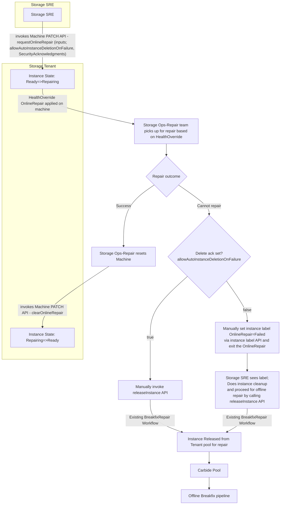

# Instance Repair Management - Online and Offline

## Metadata
- **Feature Name:** Instance-Repair-Management
- **Design Start:** 11-Dec-2025
- **Issue:** https://jirasw.nvidia.com/browse/FORGE-7143
- **PIC:** Sunil Kumar - sunilkumar@
- **Type:** High-Level Design (HLD)
- **Scope:** This workflow is for **any tenant that has a dedicated ops/repair team for online repair** (e.g. Storage). It is not limited to Storage; any such tenant can use this in-pool, OnlineRepair path.

## Problem Statement

### Current Breakfix Flow (Default / General Tenants)

The existing [Carbide Breakfix workflow](../carbide/designs/designs/0068-Breakfix-Lazarus-integration.md) supports instance repair with **full deallocation** and **pool return**:

1. Instance is taken **fully offline** (drained, workloads migrated or stopped).
2. Instance is **deallocated** from the tenant pool (tenant allocation record removed).
3. Instance is **cleaned** (tenant-specific config, secrets, and state removed).
4. Instance is **returned to the Carbide pool** and assigned to the global Breakfix/repair pipeline.

**Outcome:** The tenant receives a **different instance** from the pool after repair (new hostname, IP, identity). Re-provisioning and reconfiguration are required.

### Requirement: In-Pool Online Repair (e.g. Storage and similar tenants)

Tenants **that have a dedicated ops team for online repair** (such as Storage) require a **separate repair path** where:

- **Allocation is retained** — instance remains in the tenant pool for the lifetime of the repair.
- **Instance identity is preserved** — same hostname, IP, and logical identity post-repair.
- **Temporary out-of-service** — instance is marked unavailable for workload only for the repair window; no deallocation or pool return.

**Technical benefit:** No re-provisioning, no DNS/config/application re-pointing; repair is transparent to the rest of the tenant topology.

**Assumptions**

1. **Dedicated repair ownership** — Instances are repaired by the **tenant’s dedicated ops/repair team** (e.g. Storage’s), not the global Breakfix/repair team.
2. **Capability** — That dedicated ops/repair team has the **credentials, skills and tooling** to safely repair instances (security, data integrity, configuration) without going through the global Breakfix pipeline for routine repairs.

---

## Proposed Workflow: In-Pool Repair (dedicated ops team)

This design applies to **any tenant with a dedicated ops/repair team for online repair**; Storage is used in the diagram and examples as one such tenant.

### Design

**Instance states (tenant view)**

| Status | Meaning |
|--------|---------|
| Pending | Instance is queued or not yet being provisioned. |
| Provisioning | Instance is being provisioned for you. |
| Configuring | Instance was ready; a newer desired configuration is not yet applied. |
| Ready | Instance is ready and can be used. |
| Updating | Host or DPU firmware/software is being updated. |
| [NEW]Repairing | Instance is under online repair (e.g. dedicated ops/repair team is working on it). |
| Rebooting | Instance is rebooting. |
| Terminating | Instance is shutting down; shutdown not complete yet. |
| Error | Instance is in a failed/error state. |

**High-level flow**



**Ownership and state**

- Storage SRE plays the role of Tenant Operator 
- A **dedicated Storage ops/repair team** for the tenant (e.g. Storage repair/ops team, not global Breakfix) does the repair. They own ops and handle security, data integrity, and instance configuration.
- The instance **stays in the tenant pool** (in **Ready** when active; in **OnlineRepair** during the repair window). No deallocation or return to Carbide pool unless the instance is escalated and deleted.

**API**

- **Machine PATCH API** that the tenant can call to request **OnlineRepair** — the instance is not removed or deleted from the tenant pool. A HealthOverride **OnlineRepair** is applied on the machine so the **Storage ops team can discover and pick it up** for repair.
- The API **requires inputs** from the tenant before putting the instance into OnlineRepair (e.g. to cover risk of data corruption); the tenant must provide or confirm these inputs up front.
- The API **requires acknowledgment** (as part of the same call) for **permanent delete** and handoff to the global repair team **only when needed** — e.g. when escalation to permanent delete is a possibility.

**Escalation**

- If the instance cannot be repaired online and **delete ack is set** (`allowAutoInstanceDeletionOnFailure: true`), the Storage repair (ops) team **releases** it: deallocate from the tenant pool (e.g. delete instance / release allocation) so the instance re-enters the Carbide pool and follows the standard Breakfix pipeline.
- If the instance cannot be repaired online and **delete ack is not set** (`allowAutoInstanceDeletionOnFailure: false`), the system sets the instance label **`OnlineRepair=Failed`** using the **instance label API**. This allows the **tenant operator** to discover that online repair failed; they can then proceed with **instance deletion** to trigger the **offline repair workflow** (Breakfix) when ready.
- Once the instance is fixed under OnlineRepair, it can be put back into **active** state (Ready/Assigned) by calling the **Machine PATCH API** (exit OnlineRepair). This API can be called only by tenant [operator, admin, ops, repair] or Storage Ops.

### Design Details

#### API Specification

##### API: Enter OnlineRepair

New Machine API to bring the instance under **OnlineRepair** mode by applying the Health Override.

**Endpoint:** `PATCH /v2/org/{org}/forge/machine/{machineId}`

**Request Body (enter OnlineRepair):**
```json
{
  "requestOnlineRepair": true,
  "machineHealthIssue": {
    "category": "HARDWARE | NETWORK | PERFORMANCE | STORAGE | SOFTWARE | OTHER",
    "summary": "Brief description",
    "details": "Diagnostic information, logs, ticket numbers"
  },
  "repairPolicy": {
    "allowAutoInstanceDeletionOnFailure": true | false  
  },
  "acknowledgments": {
    "acceptDataCorruptionRisk": true,
    "acceptRepairTeamAccess": true,
    "acceptInstanceDeletionRisk": true
  }
}
```

- **`repairPolicy.allowAutoInstanceDeletionOnFailure`** — when `true`, allows escalation to offline Breakfix (permanent delete / deallocate) if online repair fails; corresponds to *Ack permanent-delete if needed* in the flow.
- **`acknowledgments`** — tenant confirms: **acceptDataCorruptionRisk** (data may be corrupted during repair), **acceptRepairTeamAccess** (repair team will have access), **acceptInstanceDeletionRisk** (risk of instance deletion if escalation to Breakfix).

##### Instance label when OnlineRepair fails (delete ack not set)

When online repair **fails** and **`allowAutoInstanceDeletionOnFailure`** is **false**, the online repair team/system updates the instance with label **`OnlineRepair=Failed`** via the **instance label API** (platform API for setting instance labels) and exits the repair process. The tenant operator can use this label to see that online repair failed and then **proceed with instance deletion** to trigger the **offline repair workflow** (Breakfix) when they are ready.

| Label key      | Label value   | When set |
|----------------|---------------|----------|
| `OnlineRepair` | `Failed`      | When repair outcome is "Cannot repair" and delete ack is not set |

#### API: Exit OnlineRepair

After the Storage repair (ops) team completes repair, the instance is put back into **active** state (Ready/Assigned) by clearing the OnlineRepair Health Override. The same Machine PATCH API is used with a request that indicates repair is complete.

**Caller:** Tenant roles [operator, admin, ops, repair] or Storage Ops (e.g. after repair is done).

##### Endpoint
`PATCH /v2/org/{org}/forge/machine/{machineId}`

##### Request Body (exit OnlineRepair)
```json
{
  "requestOnlineRepair": false,
  "clearOnlineRepair": true
}
```

| Field | Required | Description |
|-------|----------|-------------|
| `requestOnlineRepair` | Yes | Set to `false` when exiting OnlineRepair. |
| `clearOnlineRepair` | Yes | Set to `true` to clear the OnlineRepair Health Override and return the instance to active (Ready/Assigned). |

**Effect:** The Health Override for OnlineRepair is removed from the machine; the instance returns to **active (Ready/Assigned)** and is available for workload again.

#### Health Override Applied on Machine

A Health Override is applied on the machine to indicate it is in **OnlineRepair** so the Storage Ops/Repair team can discover and pick the machine for repair.

**Health Override template** (fill in placeholders when constructing or validating the override):

```json
{
  "source": "tenant-reported-issue",
  "alerts": [
    {
      "id": "OnLineRepair",
      "target": "tenant-reported",
      "message": "{\"details\":\"<diagnostic details, logs, ticket refs>\",\"issue_category\":\"<HARDWARE|NETWORK|PERFORMANCE|STORAGE|SOFTWARE|OTHER>\",\"summary\":\"<brief description>\"}",
      "tenant_message": "TenantReportedIssue: <brief description for ops>",
      "classifications": [
        "PreventAllocations",
        "PreventDeletion",
        "PreventSuperTenantAllocation",
        "SuppressExternalAlerting"
      ]
    }
  ]
}
```

#### Definitions

| Override | Purpose | Effect |
|----------|---------|--------|
| `tenant-reported-issue` | Marks issue as customer-reported | Source for the override; prevents automatic health checks from overriding; used with classifications below |
| `PreventAllocations` | Blocks new allocations | Prevents any new instance allocations on this machine |
| `PreventDeletion` *(new)* | Blocks instance deletion attempts | Prevents accidental/automatic instance deletion during repair (admin can override with `forceDelete`) |
| `PreventSuperTenantAllocation` *(new)* | Blocks SuperTenant allocations | Keeps machine in customer tenant; prevents allocation to Repair Tenant |
| `SuppressExternalAlerting` | Disables automatic alerts | Prevents duplicate alerts since issue is already reported and being addressed |

## What Gets Preserved vs Lost

### With `repairPolicy.allowAutoInstanceDeletionOnFailure: false`

| Item | Status | Details |
|------|--------|---------|
| Instance allocation | ✅ Kept | Stays in tenant |
| Machine/Instance IDs | ✅ Kept | Unchanged |
| IP address | ✅ Kept | Preserved |
| System config/data | ❌ Not Guaranteed | May be modified during repair |

### With `repairPolicy.allowAutoInstanceDeletionOnFailure: true` (if OnlineRepair fails, this path is used)

| Item | Status | Details |
|------|--------|---------|
| Instance allocation | ❌ Lost | Removed from tenant |
| Configuration | ❌ Lost | Must reconfigure |
| IP address | ❌ Lost | New IP assigned |
| All data | ❌ Lost | Unless persistent storage policy |

### When OnlineRepair fails and delete ack is not set (instance label `OnlineRepair=Failed`)

| Item | Status | Details |
|------|--------|---------|
| Instance allocation | ✅ Kept until tenant deletes | Instance stays in tenant pool |
| Instance identity (ID, hostname, IP) | ✅ Kept until tenant deletes | Preserved until tenant triggers offline repair via delete |
| Next step | — | Tenant operator deletes instance when ready → offline repair workflow (Breakfix) |

---

## FAQ

**Who is this workflow for?**  
**Any tenant that has a dedicated ops team for online repair** (e.g. Storage). It is not Storage-only. Such tenants can repair instances **without** giving up the same hostname, IP, or allocation; the instance stays in the tenant pool and is only temporarily in OnlineRepair.

**What’s the difference from the default Breakfix flow?**  
Default flow: instance is deallocated, cleaned, and returned to the Carbide pool → tenant gets a **different** instance (new IP, re-provisioning). This workflow: instance **stays allocated** and in the tenant pool; repair is inline/online; same instance comes back to active after repair.

**Who calls the API to put an instance into OnlineRepair?**  
The **tenant operator** (or tenant) invokes the Machine PATCH API with `requestOnlineRepair: true` and the required inputs (machine health issue, acknowledgments, and optionally `allowAutoInstanceDeletionOnFailure`).

**How does Storage ops find machines that need repair?**  
When the tenant calls the Machine PATCH API to enter OnlineRepair (`requestOnlineRepair: true`), a **Health Override** (e.g. `tenant-reported-issue` with `OnlineRepair`) is applied on the machine. Storage Ops/Repair discover and pick machines using this override.

**What does “permanent-delete acknowledgment” / `allowAutoInstanceDeletionOnFailure` mean?**  
If you set it to **true**, you allow the system to **deallocate and delete** the instance (and send it to the global Breakfix pipeline) if online repair cannot be completed. Use it when you accept losing this instance and getting a new one. Set to **false** if you do not want automatic escalation to permanent delete.

**Who can call the API to exit OnlineRepair and bring the instance back to active?**  
Tenant roles [operator, admin, ops, repair] or **Storage Ops** (e.g. after repair). Same endpoint: PATCH with `requestOnlineRepair: false` and `clearOnlineRepair: true`.

**Is it the same API for entering and exiting OnlineRepair?**  
Yes. Same endpoint `PATCH /v2/org/{org}/forge/machine/{machineId}`. Enter: `requestOnlineRepair: true` and machine health issue/acknowledgments. Exit: `requestOnlineRepair: false`, `clearOnlineRepair: true`.

**What if online repair fails?**  
If the Storage repair (ops) team cannot fix the instance: (1) With **allowAutoInstanceDeletionOnFailure: true**, the instance can be released (deallocated/deleted) and sent to the Carbide pool → global Breakfix. (2) With **false**, the system sets the instance label **OnlineRepair=Failed** via the instance label API; the **tenant operator** can see that online repair failed and **proceed with instance deletion** when ready to trigger the **offline repair workflow**.

**How does the tenant operator know online repair failed when they did not set the delete ack?**  
The system sets the instance label **`OnlineRepair=Failed`** via the **instance label API**. The tenant operator can see this label (e.g. via instance APIs or console) and then **proceed with instance deletion** when ready to trigger the **offline repair workflow** (Breakfix).

**What should the tenant do after seeing OnlineRepair=Failed?**  
When ready to escalate, the tenant operator can **delete the instance** (e.g. via the standard instance delete API). That triggers deallocation and the **offline repair workflow** (Carbide pool → global Breakfix). The instance remains in the tenant pool in OnlineRepair state until then.

**Who is responsible for draining workload before putting an instance into OnlineRepair?**  
The **tenant** is responsible for ensuring the instance is safe for repair (e.g. draining workloads, migrating or stopping services) before calling the API to enter OnlineRepair. The instance is marked unavailable for workload during the repair window.

**What do the required acknowledgments (acceptDataCorruptionRisk, acceptRepairTeamAccess, acceptInstanceDeletionRisk) mean?**  
The tenant confirms: **acceptDataCorruptionRisk** — data may be corrupted during repair; **acceptRepairTeamAccess** — the dedicated repair/ops team will have access to the instance; **acceptInstanceDeletionRisk** — the instance may be deleted if escalation to offline Breakfix occurs. These are required to enter OnlineRepair.

**What is preserved vs lost?**  
See **What Gets Preserved vs Lost** above: with OnlineRepair success, allocation, IDs, and IP are kept; config/data are not guaranteed. If escalation to global Breakfix happens, allocation, config, IP, and data are lost unless you have persistent storage policy.