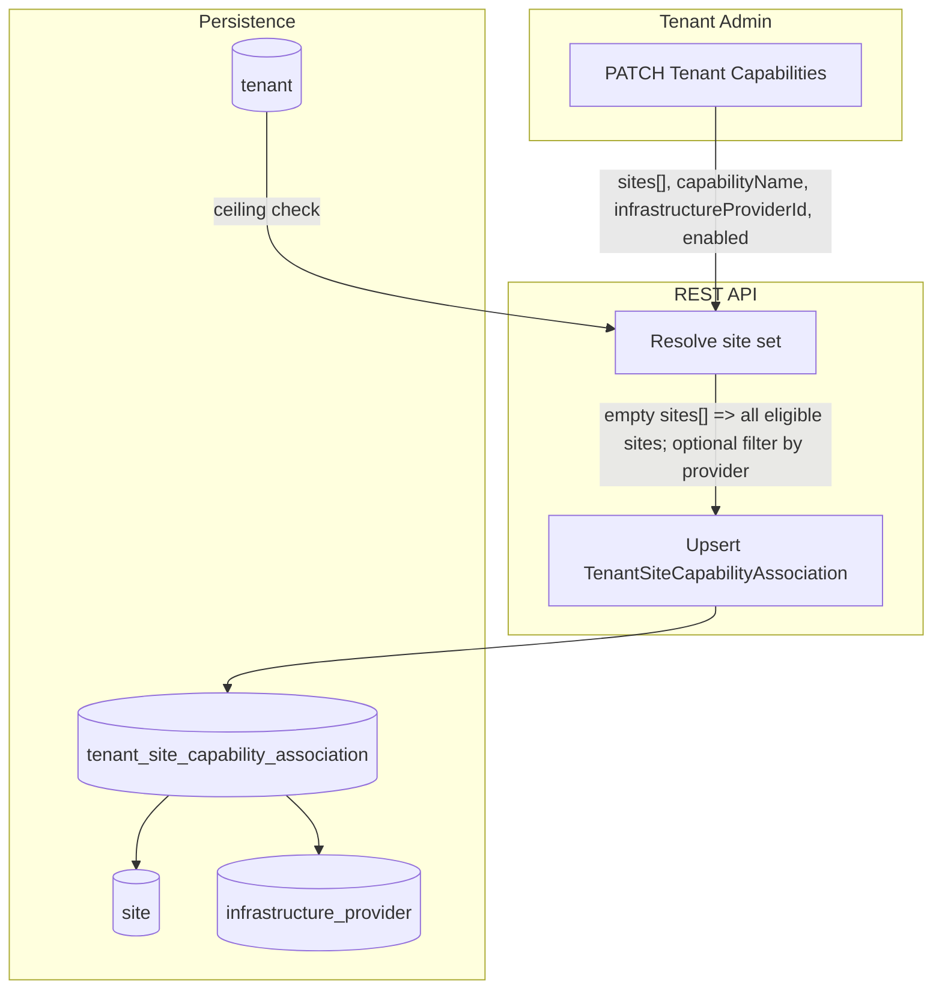

# Enhancing Tenant Capabilities — Site, Infrastructure Provider, or All

## Metadata
- **Feature Name:** Enhancing-Tenant-Capabilities
- **Design Start:** 16-Apr-2026
- **Issue:** https://github.com/NVIDIA/ncx-infra-controller-rest/issues/304
- **PIC:** Hitesh Wadekar - hwadekar@nvidia.com
- **Type:** High-Level Design (HLD)
- **Scope:** This workflow is for **privileged tenants** (e.g. tenant admins) who need to **enable or disable** capabilities such as **`TargetedInstanceCreation`** for **all sites**, **sites under a specific infrastructure provider**, or **specific sites**—instead of an implicit **global** enable on every site and provider relationship.

---

## Problem Statement

### Current Tenant Capability Flow (Privileged Tenants)

Capabilities such as **`TargetedInstanceCreation`** are stored on **`Tenant.Config`** (`tenant.config` JSONB in the database):

1. The flag is **tenant-global**: there is **no** first-class per-site or per-provider scope in the schema.
2. **Authorization** in handlers checks **`tenant.Config.TargetedInstanceCreation`** (e.g. targeted instance creation from a specific machine, **`IsRepairTenant`** on instance delete for break-fix / repair flows, privileged SKUs/machines APIs).
3. **Site visibility** for tenants with **`TargetedInstanceCreation`** can **expand** to **all sites** belonging to **every infrastructure provider** for which the tenant has a **Ready** **`TenantAccount`**, not only sites linked via **`TenantSite`**.
4. **`TenantSite`** holds membership and features such as **`EnableSerialConsole`** and generic **`config` JSONB**—it does **not** carry typed **`TenantConfig`** capability flags for per-site control.
5. **`TenantAccount`** models tenant ↔ infrastructure provider (subscription, status); it is a **relationship gate** but **not** the store for per-site capability toggles.

**Outcome:** Once **`TargetedInstanceCreation`** is **true** on the tenant, effective behavior is effectively **on everywhere** those code paths apply. Tenants cannot express “**only Site YTL**” or “**only Provider P’s sites**” without changing data ad hoc.

### Requirement: Scoped Capability Configuration

Tenants require the ability to configure capabilities (starting with **`TargetedInstanceCreation`**) so that:

- **Specific sites** — Enable or disable for **one or more** `SiteID`s.
- **All eligible sites** — Enable or disable when **no site list** is sent (interpreted as **all sites in scope**; see **Proposed Workflow**).
- **Filtered by infrastructure provider** — Optional **`InfrastructureProviderID`**: restrict the resolved site set to sites owned by that provider (e.g. “all my sites under Provider P”).
- **Provider relationship** — Existing rules (e.g. **Ready** **`TenantAccount`** for the site’s provider) remain where APIs already require them.

**Technical benefit:** **Blast-radius control**, clearer **audit** (who enabled a capability for which site), and alignment with **least privilege** for repair-related flows that depend on **`TargetedInstanceCreation`**.

**Assumptions**

1. Callers are **tenant admins** (or provider admins acting on behalf of tenants) per existing role checks.
2. **`Tenant.Config`** continues to represent the **ceiling** (platform/provider grants that the tenant may use scoped capabilities at all).
3. **Scoped** enable/disable is stored in a **dedicated association table**, not by overloading **`TenantSite`** PATCH.

---

## Proposed Workflow: Tenant Capability Association

This design applies to **any tenant org** that uses **scoped capabilities**; examples below use **`TargetedInstanceCreation`** as the first capability.

### Design

**Layers (authorization)**

| Layer | Source | Meaning |
|--------|--------|--------|
| **Ceiling** | `Tenant.Config` (e.g. `targetedInstanceCreation`) | Tenant is **allowed** to use the capability where associations permit. |
| **Scope** | `TenantSiteCapabilityAssociation` (per site) | Tenant **opts in** per **site** (materialized rows). |
| **Gate** | `TenantAccount` (where applicable today) | Tenant has a **valid** relationship with the site’s **infrastructure provider** (e.g. **Ready**). |

**Effective check (conceptual)**

```text
effective(TargetedInstanceCreation, tenant, site) =
  tenant.Config.TargetedInstanceCreation
  AND association_enabled(tenant, site)
  AND provider_gate(tenant, site)   // where existing APIs require it
```

`association_enabled` is **true** when a row exists for **`(tenant_id, site_id)`** with **`targeted_instance_creation = true`**. **Default when no row exists** should be defined at rollout (e.g. **strict**: false; migration may backfill from legacy tenant-global behavior).

**High-level flow**



**Ownership**

- **Tenant admin** (or provider admin, per policy) issues the **PATCH** to set scoped capabilities.
- The service **materializes** one **association row per site** for the resolved set (see **Empty `sites` semantics** below)—no ambiguous “single row for all sites” unless explicitly designed with nullable `site_id` (not recommended; prefer materialized rows for uniform queries).

**API**

- **PATCH Tenant** (or a dedicated sub-resource, e.g. **`PATCH /v2/org/{org}/forge/tenant/{tenantId}/capabilities`**) accepts **`sites`**, **`capabilityName`**, optional **`infrastructureProviderId`**, and **`enabled`** (or equivalent).
- **Empty `sites`** ⇒ apply to **all sites** in the resolved eligible set (optionally **restricted** by **`infrastructureProviderId`**).
- **Non-empty `sites`** ⇒ apply only to listed sites (each must pass validation).
- Handler **creates or updates** rows in **`TenantSiteCapabilityAssociation`**.

---

### Design Details

#### Data model: `TenantSiteCapabilityAssociation`

Persistent store for **per-site** tenant capability flags. One row per **`(tenant, site)`** pair; PATCH handlers **upsert** rows when the tenant enables or disables a capability for a resolved site set.

| Item | Value |
|------|--------|
| **Go type** | `TenantSiteCapabilityAssociation` |
| **Package** | `db/pkg/db/model` (alongside `Tenant`, `TenantSite`, …) |
| **SQL table** | `tenant_site_capability_association` |
| **Bun alias (suggested)** | `tsca` |

##### Fields (logical model)

| Go field | SQL column | Type | Bun / constraints | JSON (API / OpenAPI) |
|----------|------------|------|-------------------|----------------------|
| `ID` | `id` | `UUID` | `pk`, `type:uuid` | `id` |
| `TenantID` | `tenant_id` | `UUID` | `notnull`, FK → `tenant(id)` | — |
| `SiteID` | `site_id` | `UUID` | `notnull`, FK → `site(id)` | — |
| `InfrastructureProviderID` | `infrastructure_provider_id` | `UUID` | `notnull`, FK → `infrastructure_provider(id)` | — |
| `TargetedInstanceCreation` | `targeted_instance_creation` | `BOOLEAN` | `notnull`, default `false` (or per migration policy) | maps from `capabilityName` + `enabled` |
| `Created` | `created` | `TIMESTAMPTZ` | `notnull`, default `current_timestamp` | `created` |
| `Updated` | `updated` | `TIMESTAMPTZ` | `notnull`, default `current_timestamp` | `updated` |
| `Deleted` | `deleted` | `TIMESTAMPTZ` | nullable, **soft delete** (if used) | — |
| `CreatedBy` | `created_by` | `UUID` | `notnull`, FK → `user(id)` | — |

- **`InfrastructureProviderID`** is **denormalized** from **`Site`** (each site has one provider). On insert/update, set from **`site.infrastructure_provider_id`** and **reject** if the client-supplied provider filter does not match (when provided).
- **`TargetedInstanceCreation`** is the first capability column; future capabilities can add columns (e.g. `enable_foo`) or move to a normalized `(capability_name, enabled)` row model in a later revision.

##### Illustrative Bun struct (implementation reference)

```go
// TenantSiteCapabilityAssociation stores per-site capability flags for a Tenant.
// One row per (tenant_id, site_id); see design doc db/tenant-capability.md.
type TenantSiteCapabilityAssociation struct {
	bun.BaseModel `bun:"table:tenant_site_capability_association,alias:tsca"`

	ID                         uuid.UUID  `bun:"type:uuid,pk"`
	TenantID                   uuid.UUID  `bun:"tenant_id,type:uuid,notnull"`
	Tenant                     *Tenant    `bun:"rel:belongs-to,join:tenant_id=id"`
	SiteID                     uuid.UUID  `bun:"site_id,type:uuid,notnull"`
	Site                       *Site      `bun:"rel:belongs-to,join:site_id=id"`
	InfrastructureProviderID   uuid.UUID  `bun:"infrastructure_provider_id,type:uuid,notnull"`
	InfrastructureProvider     *InfrastructureProvider `bun:"rel:belongs-to,join:infrastructure_provider_id=id"`
	TargetedInstanceCreation   bool       `bun:"targeted_instance_creation,notnull"`
	Created                    time.Time  `bun:"created,nullzero,notnull,default:current_timestamp"`
	Updated                    time.Time  `bun:"updated,nullzero,notnull,default:current_timestamp"`
	Deleted                    *time.Time `bun:"deleted,soft_delete"`
	CreatedBy                  uuid.UUID  `bun:"type:uuid,notnull"`
}
```

##### Relations

| Relation | Cardinality | Join |
|----------|-------------|------|
| `Tenant` | many association rows → one tenant | `tenant_id` = `tenant.id` |
| `Site` | many association rows → one site | `site_id` = `site.id` |
| `InfrastructureProvider` | many association rows → one provider | `infrastructure_provider_id` = `infrastructure_provider.id` |

##### Indexes and constraints

| Name / rule | Purpose |
|-------------|---------|
| **UNIQUE** `(tenant_id, site_id)` | At most one row per tenant per site for this table shape. |
| **INDEX** `(tenant_id)` | List/filter capabilities by tenant. |
| **INDEX** `(infrastructure_provider_id)` | Bulk updates and queries “all sites under provider P” for a tenant. |
| **INDEX** `(site_id)` | Resolve effective capability when handling instance/machine APIs keyed by site. |
| **FK** `tenant_id`, `site_id`, `infrastructure_provider_id`, `created_by` | Referential integrity; `ON DELETE` behavior should match product (e.g. cascade on tenant delete vs. soft delete). |

**Relationship to existing models**

- **`TenantSite`**: unchanged for membership; **`TenantSiteCapabilityAssociation`** holds **capability** flags only.
- **`TenantAccount`**: still used for **provider** eligibility where APIs require a **Ready** account; not replaced by this table.

#### API Specification (illustrative)

**Endpoint (illustrative):** `PATCH /v2/org/{org}/forge/tenant/{tenantId}/capabilities`

The same endpoint is used for **enable** and **disable**; **`enabled`** selects the operation. Use **`sites`** with **one or more** site UUIDs to scope to **specific sites**; use **`sites: []`** for **all** eligible sites (see field table).

##### PATCH — enable capability (example: bulk or all sites)

```json
{
  "capabilityName": "TargetedInstanceCreation",
  "sites": [],
  "infrastructureProviderId": "uuid-or-omit",
  "enabled": true
}
```

##### PATCH — enable capability for **specific sites** only

```json
{
  "capabilityName": "TargetedInstanceCreation",
  "sites": ["550e8400-e29b-41d4-a716-446655440000", "6ba7b810-9dad-11d1-80b4-00c04fd430c8"],
  "infrastructureProviderId": "uuid-or-omit",
  "enabled": true
}
```

##### PATCH — **disable** capability for **specific sites**

Use **`enabled: false`** with a **non-empty** **`sites`** array so only those sites are turned off; other sites keep their current association.

```json
{
  "capabilityName": "TargetedInstanceCreation",
  "sites": ["550e8400-e29b-41d4-a716-446655440000"],
  "infrastructureProviderId": "uuid-or-omit",
  "enabled": false
}
```

- **`infrastructureProviderId`** is optional when **`sites`** is non-empty; if provided, each listed **`site_id`** must belong to that provider (validation), or omit it when sites are already unambiguous.

##### PATCH — **disable** capability for **all** eligible sites

Same as enable-all, but with **`enabled: false`** and **`sites: []`** (optionally combined with **`infrastructureProviderId`** to disable only under that provider).

```json
{
  "capabilityName": "TargetedInstanceCreation",
  "sites": [],
  "infrastructureProviderId": "uuid-or-omit",
  "enabled": false
}
```

| Field | Required | Description |
|--------|----------|-------------|
| `capabilityName` | Yes | e.g. `TargetedInstanceCreation` (maps to storage column or enum). |
| `sites` | No | **Empty array** ⇒ apply to **all eligible sites** (after optional provider filter). **Non-empty** ⇒ apply only to listed site IDs (**use this for disable-on-specific-sites**). |
| `infrastructureProviderId` | No | If set, **restrict** the resolved site set to sites whose **`site.infrastructure_provider_id`** matches. If **`sites`** is non-empty, may be used for **validation** only. |
| `enabled` | Yes | **`true`** = opt in for the resolved sites; **`false`** = opt out (**disable**) for the resolved sites—update **`targeted_instance_creation`** to **false** or **delete** the association row per product policy. |

**Server behavior**

1. Verify **tenant ceiling** for **enable** (`enabled: true`): e.g. `Tenant.Config.TargetedInstanceCreation` must be **true** before allowing scoped **enable** (policy decision). For **disable** (`enabled: false`), **ceiling** may remain true while individual sites are turned off—**effective** capability for a site is false when the association is false or absent.
2. **Resolve sites**
   - If **`sites`** is empty: enumerate **eligible sites** (product-defined: e.g. union of **`TenantSite`** and/or sites reachable via **`TenantAccount`** for **Ready** accounts—align with listing and instance APIs).
   - If **`infrastructureProviderId`** is set: filter resolved sites to that provider.
   - If **`sites`** is non-empty: validate each site is eligible and optionally matches **`infrastructureProviderId`** when provided.
3. For each resolved **`site_id`**, **upsert** **`TenantSiteCapabilityAssociation`** with **`infrastructure_provider_id`** from **`Site`**, set **`targeted_instance_creation`** from **`enabled`**.

**DELETE (optional)**

- Either **PATCH with `enabled: false`** or **`DELETE`** association rows by **`tenant_id`** + **`site_id`** or by filter (document idempotency).

#### Handler migration (downstream)

Replace checks that use **only** `tenant.Config.TargetedInstanceCreation` with **`effective(..., siteID)`** wherever the request is **site-scoped** (instance create/delete, machine APIs, site listing behavior, etc.). Centralize in shared helpers to avoid drift.

**Site listing behavior**

- Today, privileged tenants may see **all provider sites** when **`TargetedInstanceCreation`** is on. With this design, product should choose: **narrow** listed sites to those with **association enabled**, or keep a **discovery** list but **disable** actions until scoped on.

---

## What Gets Preserved vs Lost

### Compared to today (tenant-global flag only)

| Item | Status | Details |
|------|--------|---------|
| **`Tenant.Config` as ceiling** | ✅ Preserved | Still the top-level entitlement from provider/platform. |
| **Implicit “all sites” behavior** | ❌ Replaced | Replaced by **explicit** rows in **`TenantSiteCapabilityAssociation`** (after migration / defaults). |
| **Per-site blast radius** | ✅ Gained | Tenant can **limit** where targeted creation / repair flags apply. |
| **`TenantSite` row content** | ✅ Preserved | No requirement to patch **`TenantSite`** for these capabilities. |

### Migration options

| Strategy | Behavior |
|----------|----------|
| **Conservative** | For tenants with **`TargetedInstanceCreation`** already **true**, **backfill** association rows **enabled** for all previously implicit sites to minimize behavior change. |
| **Strict** | New associations default **off** until tenant sets them; **smaller** blast radius, **behavior change** for existing tenants. |

---

## FAQ

**Why a new table instead of patching `TenantSite`?**  
Keeps **membership** and **serial console** separate from **capability** toggles; avoids overloading **`TenantSite.config`** without schema; supports **audit** and **bulk** updates cleanly.

**What does empty `sites` mean?**  
**Apply to all sites** in the **eligible** resolved set for that tenant, optionally **filtered** by **`infrastructureProviderId`**.

**Why store `infrastructure_provider_id` on the association row?**  
**Query and bulk** operations by provider without always joining **`site`**; must remain **consistent** with the site’s provider.

**How does this relate to `IsRepairTenant` on instance delete?**  
Today the API requires **`tenant.Config.TargetedInstanceCreation`**. After this HLD, it should require **`effective(TargetedInstanceCreation, instance.SiteID)`** (plus existing role/account rules).

**Who can call the PATCH?**  
Typically **tenant admin** for their org; **provider admin** may set **ceiling** on **`Tenant.Config`** per existing APIs.

**What if `Tenant.Config.TargetedInstanceCreation` is false?**  
**Ceiling** is false: scoped associations should **not** grant the capability (reject enable or treat as no-op per policy).

**Is this the same as OnlineRepair / Machine PATCH?**  
**No.** Online repair flows (e.g. **`repair.md`**) are a **separate** HLD. This document only defines **where** tenant capabilities apply; repair APIs remain governed by those designs plus **effective** capability checks.
